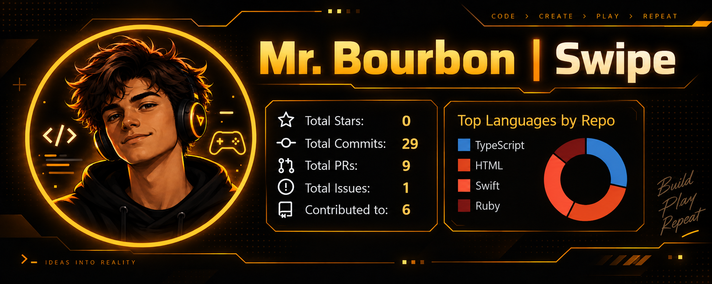

<h1 align="center">Hey, I'm Swipe 👋</h1>

  

  I build things, break them, fix them, and somehow turn small ideas into way bigger projects.

  
  
  

---

## 👋 About Me

I'm **Swipe**.

Most of what I do revolves around building software, experimenting with AI, messing with infrastructure, and seeing how far I can take an idea before it turns into a real project.

I bounce between:

- 🍎 Native macOS development
- 🪟 Windows development & testing
- 🐧 Linux
- 🌐 Full-stack web development
- 🤖 AI agents & automation
- 🧠 Local AI and model tooling
- ☁️ Cloud infrastructure
- 🐳 Containers & deployment
- 🍷 Wine & Windows compatibility
- 🔌 APIs & integrations
- 🧪 Random side projects that were definitely supposed to stay small

A lot of my projects start with:

> **"wait... couldn't I just build that?"**

and then somehow I'm still working on it three days later.

---

# 🥃 Bourbon

### Modern Windows compatibility for macOS.

Bourbon is the project I'm spending most of my time on right now.

It's a native macOS application built with **SwiftUI** for running, managing, and troubleshooting Windows applications and games on macOS.

  
  
  

Originally inspired by Whisky, Bourbon has grown into its own actively developed compatibility project with custom runtime infrastructure, onboarding, diagnostics, installer handling, application discovery, licensing, packaging, and compatibility tooling.

### What Bourbon does

- 🍾 Create & manage Windows Bottles
- 🎮 Run Windows applications and games on macOS
- 🖥 Native SwiftUI interface
- 🍷 BourbonWine runtime integration
- 💻 Apple Silicon & Intel Mac support
- 📦 Distillery package management
- 🔍 Installer & process diagnostics
- ⚡ Sparkle update support
- 🐞 Built-in bug reporting
- 🔐 Licensing & account flows
- 🛠 Runtime API infrastructure
- 🧪 Stable, Beta & development builds

> [!IMPORTANT]
> **Public Bourbon downloads are currently paused**
>
> Runtime and compatibility changes are being validated before the next public build.

[**View Bourbon →**](https://github.com/Unblockerfire/Bourbon)  
[**Join the Bourbon Discord →**](https://discord.gg/bpm6EGSVMR)

---

# 🧰 Stuff I Use

## 💻 Platforms

  

---

## 👨‍💻 Languages

  

---

## 🌐 Web & App Development

  

  
  

---

## 🗄️ Databases & Backend

  

  

---

## ☁️ Cloud & Infrastructure

  

  

---

## 🛠 Development Tools

  

  
  

---

## 🤖 AI & Automation

  
  
  
  
  
  

---

## 🍷 macOS & Compatibility

  
  
  
  
  
  

---

## 🔌 APIs & Services

  
  
  
  

---

## ⚙️ Other Stuff in the Toolbox

`GitHub Actions`
`Wine`
`BourbonWine`
`SwiftUI`
`REST APIs`
`OAuth`
`Docker`
`WSL2`
`Rosetta`
`Sparkle`
`MoltenVK`
`Cloudflare`
`Fly.io`
`Local Models`
`AI Agents`
`Automation`
`Git`
`GitHub`
`Xcode`
`Firebase`
`PostgreSQL`
`Prisma`
`Neon`

---

# 🔬 What I'm Usually Messing With

- Building native macOS apps with SwiftUI
- Figuring out Wine and Windows compatibility
- Building AI-assisted workflows
- Running local models
- Making AI agents do useful things
- Backend architecture
- APIs and authentication
- Deployment pipelines
- GitHub Actions
- Docker & containers
- Windows, macOS & Linux
- Debugging something that absolutely worked five minutes ago

---

# 📊 GitHub Stats

  
  

  

---

# 🧠 Currently Learning

Mostly whatever the current project forces me to learn.

Right now that's a lot of:

- macOS internals
- Swift & SwiftUI
- Wine
- System architecture
- Backend design
- Process management
- AI agent workflows
- Local AI
- Infrastructure
- Making software slightly less held together by duct tape

---

  <b>build → break → debug → repeat</b>

  <i>probably coding something that was supposed to be a "small side project"</i>

